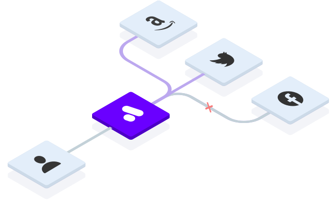

# @anonacy/api

## About
Anonacy's v2 api enables simplified control over a [Postal](https://docs.postalserver.io/) open-source mail server. 

It is designed for email aliasing and can be easily deployed using docker on the same machine as Postal.

You can use the [@anonacy/app](https://github.com/anonacy/app) project as a UI for the api.

## Features

| Available                 | Planned                        |
|---------------------------|--------------------------------|
| ✅ Email Alias Routing             | 🕑 Webhooks                       |
| ✅ Address Endpoints   | 🕑 URL Endpoints for aliases      |
| ✅ Domain Management         | 🕑 IP Pooling                     |
| ✅ DNS Record Setup          | 🕑 User Authentication |
| ✅ Delivery Status Logs   | 🕑 Org & Server Management        |

## Authorization

Uses the credentials system within postal to generate api keys. These automatically scope to the org & server within postal. Use header: `Authorization: Bearer APIKEY` or the [@anonacy/app](https://github.com/anonacy/app)

## Documentation

Full api documentation can be found here:
https://api2.anonacy.com/docs/ or by running your own instance and navigating to the `/docs` route in a browser.

## Installation

* To host the api yourself, follow the guide in [install.md](./INSTALL.md)
* To contribute to the api or host locally, follow the guide in [contributing.md](./CONTRIBUTING.md)

***

Built by hew🪶

